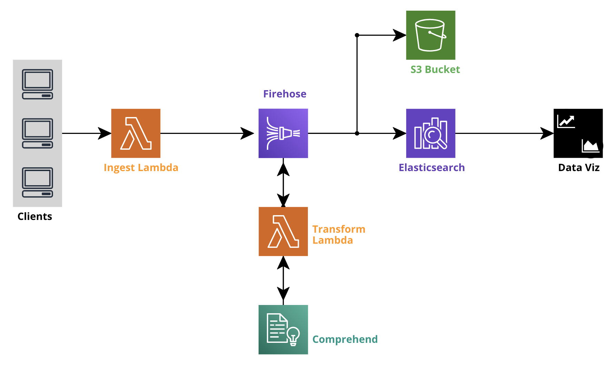

# AWS NLP Data Pipeline
Ingest real-time streaming text data with automatic appending of NLP metadata



## Overview

This project represents a mostly serverless data engineering architecture for ingesting real-time streaming data and automatically appending NLP metadata via managed AWS services. The project may serve as a baseline for implementing complex ingestion pipelines powering NLP services.

The following AWS services are leveraged:

* [CloudFormation](https://aws.amazon.com/cloudformation/) -- infrastructure as code (IaC)
* [Lambda](https://aws.amazon.com/lambda/) - ingestion and transformation
* [Firehose](https://aws.amazon.com/kinesis/data-firehose/) - stream buffering
* [Comprehend](https://aws.amazon.com/comprehend/) - NLP metadata enrichment
* [Elasticsearch Service](https://aws.amazon.com/elasticsearch-service/) - document storage and search
* [S3](https://aws.amazon.com/s3/) - persistent object storage

## Deployment

This project leverages [GitHub Actions](https://github.com/features/actions) for its CI/CD pipeline. If forking, you can deploy via your own actions by providing the following Secrets in your repository:

* AWS_ACCESS_KEY_ID
* AWS_SECRET_ACCESS_KEY
* AWS_REGION_ID
* IP_ADDRESS

## Example

A [dataset](https://www.kaggle.com/kavita5/twitter-dataset-avengersendgame) for demonstration purposes has been provided. Use the following script to send example data to the Ingest Lambda for processing.

```bash
python stream.py
```
